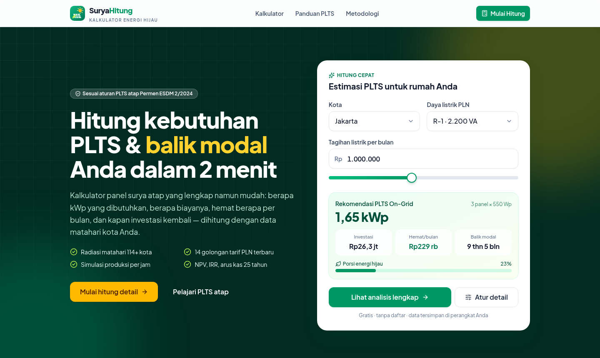
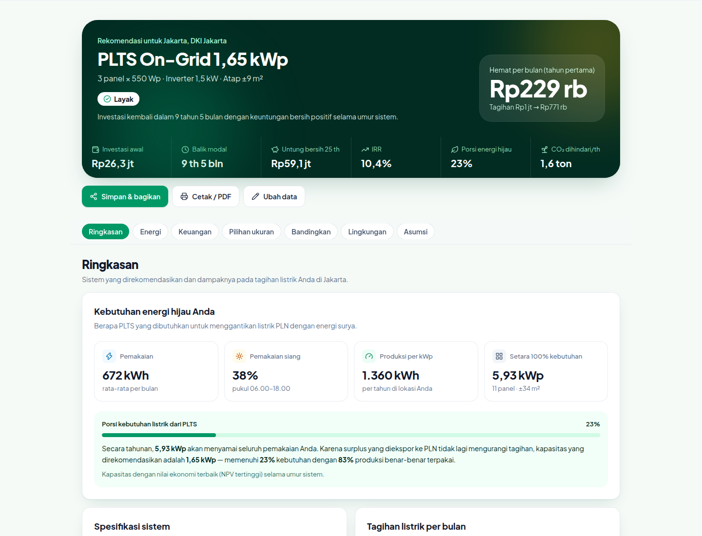
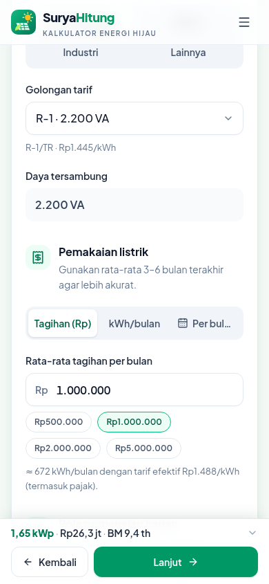

# ☀️ SuryaHitung — Kalkulator Kebutuhan PLTS & Balik Modal

Aplikasi web **full stack** untuk menghitung kebutuhan PLTS (panel surya) atap, biaya investasi, penghematan tagihan, dan
estimasi balik modal secara lengkap — dengan antarmuka bernuansa hijau yang nyaman di ponsel maupun desktop. SuryaHitung adalah
modul pertama platform **Kalkulator Energi Hijau**.

📄 Spesifikasi produk: [`docs/PRD.md`](docs/PRD.md)



## Fitur utama

- **Hitung cepat** di halaman depan (kota + daya PLN + tagihan → estimasi instan) dan **wizard 4 langkah** yang detail:
  Lokasi & Atap → Pemakaian Listrik → Sistem PLTS → Biaya & Pembiayaan, dengan ringkasan live.
- **Sesuai regulasi terbaru** — Permen ESDM No. 2 Tahun 2024: surplus ke PLN tidak mengurangi tagihan, sehingga kapasitas
  dioptimalkan untuk konsumsi sendiri. Rekening minimum pascabayar, PBJT, dan PPN (R-3) ikut dihitung.
- **Simulasi per jam** 12 bulan × 25 tahun: model posisi matahari & radiasi (Collares-Pereira & Rabl, Erbs, transposisi
  isotropik, suhu sel), pola pemakaian 24 jam, dan baterai LiFePO4.
- **Optimasi kapasitas** otomatis (NPV terbaik), mode target % energi hijau, atau manual; batas luas atap & daya tersambung.
- **On-grid, hybrid, off-grid** — lengkap dengan perbandingan ketiganya untuk pemakaian Anda.
- **Analisis finansial**: payback sederhana & terdiskonto, NPV, IRR, ROI, LCOE, arus kas tahunan, simulasi cicilan, dan
  analisis sensitivitas (tornado).
- **Dampak lingkungan**: CO₂ dihindari, setara pohon & km mobil, porsi energi hijau.
- **Simpan & bagikan** (tautan `/hasil/{id}`), bagikan ke WhatsApp, dan **cetak/PDF** dengan tata letak khusus.
- Data radiasi **NASA POWER** berbasis koordinat (di-cache) dengan fallback dataset ±110 kota Indonesia.
- Halaman **Panduan** (regulasi, langkah pemasangan, FAQ) dan **Metodologi** (rumus & asumsi yang transparan).
- **API publik** untuk integrasi.

| Hasil perhitungan (desktop)          | Wizard (mobile)                                      |
| ------------------------------------ | ---------------------------------------------------- |
|  |  |

## Teknologi

| Lapisan          | Teknologi                                                                   |
| ---------------- | --------------------------------------------------------------------------- |
| Framework        | Next.js 16 (App Router, Turbopack) · React 19 · TypeScript 5.9              |
| UI               | Tailwind CSS 4 · Radix UI (primitif aksesibel) · Lucide · Plus Jakarta Sans |
| Grafik           | Recharts 3 (palet tervalidasi kontras & buta warna)                         |
| State & validasi | Zustand (+ localStorage) · Zod 4 (skema dibagi frontend & API)              |
| Database         | SQLite/libSQL via Drizzle ORM (file lokal atau Turso)                       |
| Pengujian        | Vitest (unit & API) · Playwright (E2E desktop & mobile)                     |

## Memulai

Prasyarat: **Node.js ≥ 22.12** dan npm.

```bash
npm ci
cp .env.example .env        # opsional — nilai default sudah berjalan
npm run dev                 # buka http://localhost:3000
```

Database SQLite dibuat otomatis di `data/suryahitung.db` dan migrasi dijalankan saat server pertama kali mengakses database.

### Variabel lingkungan

| Variabel               | Default                      | Keterangan                                             |
| ---------------------- | ---------------------------- | ------------------------------------------------------ |
| `DATABASE_URL`         | `file:./data/suryahitung.db` | URL libSQL: file lokal atau `libsql://…` (Turso)       |
| `DATABASE_AUTH_TOKEN`  | –                            | Token Turso (kosongkan untuk file lokal)               |
| `NEXT_PUBLIC_SITE_URL` | `http://localhost:3000`      | URL publik untuk metadata, sitemap, dan tautan berbagi |
| `NASA_POWER_ENABLED`   | `true`                       | Ambil data radiasi NASA POWER berdasarkan koordinat    |

### Skrip

| Perintah                      | Fungsi                                                                   |
| ----------------------------- | ------------------------------------------------------------------------ |
| `npm run dev`                 | Server pengembangan                                                      |
| `npm run build` / `npm start` | Build & jalankan produksi                                                |
| `npm run check`               | Lint + typecheck + cek format + unit test                                |
| `npm test`                    | Unit & API test (Vitest)                                                 |
| `npm run test:e2e`            | E2E Playwright (menjalankan `npm start` otomatis; butuh `npm run build`) |
| `npm run format`              | Format kode (Prettier)                                                   |
| `npm run db:generate`         | Buat migrasi SQL dari `src/lib/db/schema.ts`                             |

> Bila memakai Chromium yang sudah terpasang di sistem, set `PLAYWRIGHT_CHROMIUM_PATH=/path/ke/chromium` saat menjalankan E2E.

## Struktur proyek

```
src/
  app/                 halaman (/, /kalkulator, /hasil/[id], /panduan, /metodologi) & route API (/api/*)
  components/          ui/ (design system), layout/, landing/, calculator/ (wizard), results/ (dashboard & grafik)
  lib/engine/          engine perhitungan murni (dipakai peramban & server) + skema input Zod
  lib/data/            data referensi: tarif PLN, kota & radiasi, harga, panel, profil beban
  lib/db/              skema & klien Drizzle (libSQL)
  lib/server/          layanan server: laporan, radiasi NASA POWER + cache, rate limit
  store/, hooks/       state wizard (Zustand) & hook perhitungan
tests/                 unit & API test      e2e/  Playwright      drizzle/  migrasi SQL      docs/  PRD
```

## API

Semua endpoint mengembalikan JSON; kesalahan berformat `{ "error": { "code", "message", "issues?" } }` berbahasa Indonesia.

| Endpoint                        | Keterangan                                                                                                                                       |
| ------------------------------- | ------------------------------------------------------------------------------------------------------------------------------------------------ |
| `POST /api/calculate`           | Perhitungan lengkap. Body = input kalkulator (boleh parsial). Query `view=summary` untuk ringkasan, `extras=1` untuk perbandingan & sensitivitas |
| `GET /api/irradiance?lat=&lon=` | GHI & suhu bulanan (NASA POWER → cache → dataset kota terdekat)                                                                                  |
| `GET /api/locations?q=`         | Cari kota dalam dataset                                                                                                                          |
| `GET /api/tariffs`              | Tabel tarif PLN yang dipakai                                                                                                                     |
| `POST /api/reports`             | Simpan laporan `{ title?, input }` → `{ id, url }`                                                                                               |
| `GET /api/reports/{id}`         | Ambil laporan tersimpan                                                                                                                          |
| `GET /api/health`               | Status layanan & database                                                                                                                        |

Contoh:

```bash
curl -X POST "http://localhost:3000/api/calculate?view=summary" \
  -H "content-type: application/json" \
  -d '{"location":{"cityId":"surabaya"},"consumption":{"tariffId":"R2","monthlyBill":2500000,"profileId":"rumah-siang"}}'
```

## Metodologi singkat

1. Tagihan → kWh memakai tarif golongan + PBJT (+ PPN untuk R-3).
2. Produksi per kWp dihitung per 10 menit untuk hari rata-rata tiap bulan (posisi matahari, fraksi difus Erbs, transposisi
   isotropik, suhu sel NOCT, susut ±11,5%, efisiensi inverter 97,5%) → PR ±0,78–0,80.
3. Produksi dicocokkan dengan profil beban 24 jam; surplus mengisi baterai atau mengalir ke PLN tanpa kompensasi.
4. Semua kapasitas kandidat dievaluasi 25 tahun (kenaikan tarif, degradasi, O&M, penggantian inverter/baterai) → NPV terbaik.

Detail rumus dan asumsi default ada di halaman `/metodologi` dan [`docs/PRD.md`](docs/PRD.md) §9.

## Memperbarui data referensi

| Data                   | Berkas                                                                           | Catatan                                                              |
| ---------------------- | -------------------------------------------------------------------------------- | -------------------------------------------------------------------- |
| Tarif PLN              | `src/lib/data/tariffs.ts`                                                        | Perbarui `TARIFF_LAST_UPDATED` & `TARIFF_PERIOD_LABEL` tiap triwulan |
| Harga sistem & baterai | `src/lib/data/prices.ts`                                                         | Titik acuan harga per kWp, kelas komponen, premi hybrid/off-grid     |
| Kota & radiasi         | `src/lib/data/locations.ts`                                                      | GHI tahunan, suhu, pola musiman, alias pencarian                     |
| Asumsi default         | `src/lib/engine/input.ts` (`createDefaultInput`) & `src/lib/engine/constants.ts` | Pastikan `npm test` tetap lulus                                      |

## Deploy

- **Vercel + Turso** (serverless): buat database Turso, set `DATABASE_URL=libsql://…` dan `DATABASE_AUTH_TOKEN`, lalu deploy.
  File migrasi `drizzle/` ikut dibundel ke route yang mengakses database.
- **VPS / Docker** (SQLite file):

  ```bash
  docker build -t suryahitung .
  docker run -p 3000:3000 -v suryahitung-data:/app/data -e NEXT_PUBLIC_SITE_URL=https://domain-anda.id suryahitung
  ```

Bila database tidak tersedia, kalkulator tetap berfungsi penuh (perhitungan berjalan di peramban); hanya fitur simpan/bagikan
yang menampilkan pesan gagal.

## Roadmap

- **Fase 2**: form "Minta Penawaran" + dasbor admin (leads, pembaruan tarif/harga tanpa deploy), pemilih lokasi berbasis peta,
  analitik produk, mode gelap, bahasa Inggris.
- **Fase 3**: modul energi hijau lain (PLTB skala kecil, pemanas air surya, biogas, kendaraan listrik) dan direktori installer.

## Disclaimer

Hasil SuryaHitung adalah **estimasi** berbasis model dan asumsi umum, bukan penawaran harga maupun jaminan kinerja. Keputusan
investasi sebaiknya didukung survei lokasi dan penawaran resmi dari installer bersertifikat serta mengikuti ketentuan PLN.
